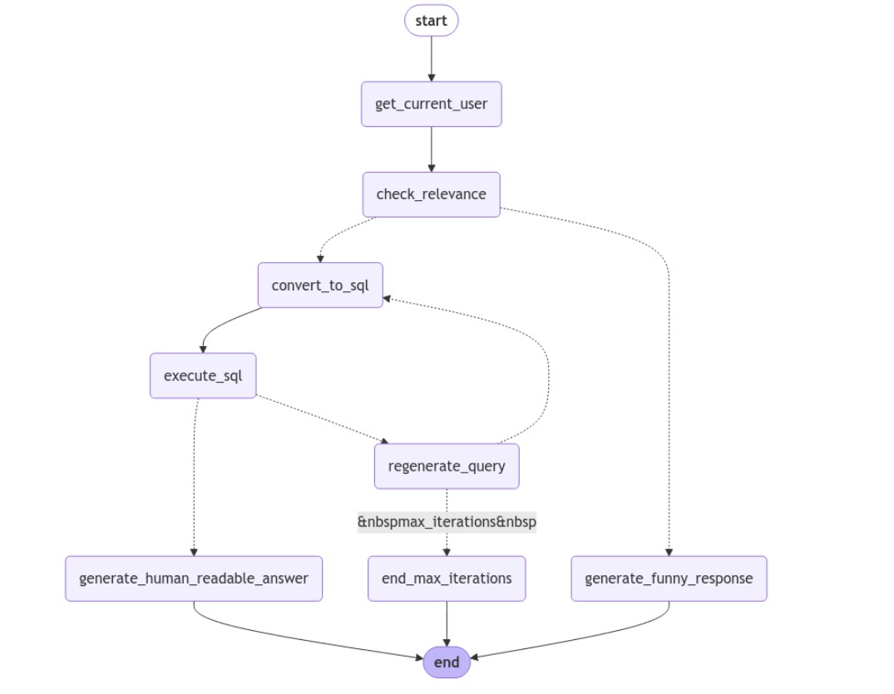

### 🍽️ Order Management System - Langchain, SQLAlchemy, SQLite

This project is a restaurant order management interface built using **Python 3.12.8**, **SQLAlchemy ORM**, and **SQLite** as the database engine. It provides a simplified backend for placing and tracking orders, retrieving user history, and interacting through a natural language interface powered by Langchain.

---

### 📦 Setup & Installation

Follow these steps to set up the environment and run the project:

1. **Install Python 3.12.8**  
   Download and install from the official [Python website](https://www.python.org/downloads/release).

2. **Create a virtual environment** (recommended):

   ```bash
   python -m venv venv
   source venv/bin/activate   # On Windows: venv\Scripts\activate
   ```

3. **Install dependencies**:

   ```bash
   pip install -r requirements.txt
   ```

4. **Set up environmental variables**:  
   Create a `.env` file in the root directory with the following content:

   ```env
   DATABASE_URL=sqlite:///orders.db
   ```

5. **Clone or download the repository**:

   ```bash
   git clone https://github.com/your-username/order-management-system.git
   cd order-management-system
   ```

---

### 📊 Database Schema

The SQLite database includes three main tables:

- **Users**  
  Stores user information and is linked to the Orders table.

- **Food**  
  Contains the available food menu items and is also connected to Orders.

- **Orders**  
  Records each order placed, linking both user and food item with timestamps and quantities.

All relationships are handled using SQLAlchemy's ORM layer, allowing you to query and update using Pythonic syntax.

---
### 🧠 Features

- **Natural Language Query Support**  
  Users can ask questions like _"What did I order yesterday?"_ or _"Order 2 pizzas"_ using Langchain's query-to-SQL conversion logic.

- **Visualization**  
  Order history and details can be visualized within Jupyter via simple queries.

- **Regeneration Loop**  
  If a query is malformed or not relevant, the system attempts to regenerate a better version or provide a humorous response.

---

### 🧬 System Flowchart

The flowchart below illustrates the process of handling a user request, converting it into an SQL query, and returning a response:



#### 🔁 Flowchart Description
1. **Start**: User sends a query or request.
2. **get_current_user**: The system retrieves the current user context.
3. **check_relevance**: It checks whether the request is relevant to the order system.
4. Based on relevance:
   - If relevant:
     - **convert_to_sql** → **execute_sql** → **generate_human_readable_answer**
   - If irrelevant or ambiguous:
     - **regenerate_query** attempts to fix the query.
     - If it fails after `max_iterations`, fallback to **generate_funny_response**.
5. **end_max_iterations**: Ensures the system doesn’t get stuck in an infinite loop.
6. The system then **ends** after outputting a response.
---

### 📁 Project Structure

```
order-management-system/
│
├── sql.ipynb                 # Main notebook interface
├── models.py                 # SQLAlchemy models
├── utils.py                  # Helper functions
├── .env                      # Environment variables (DATABASE_URL)
├── requirements.txt          # Python dependencies
├── snap.png                  # System workflow diagram
└── README.md                 # This file
```
